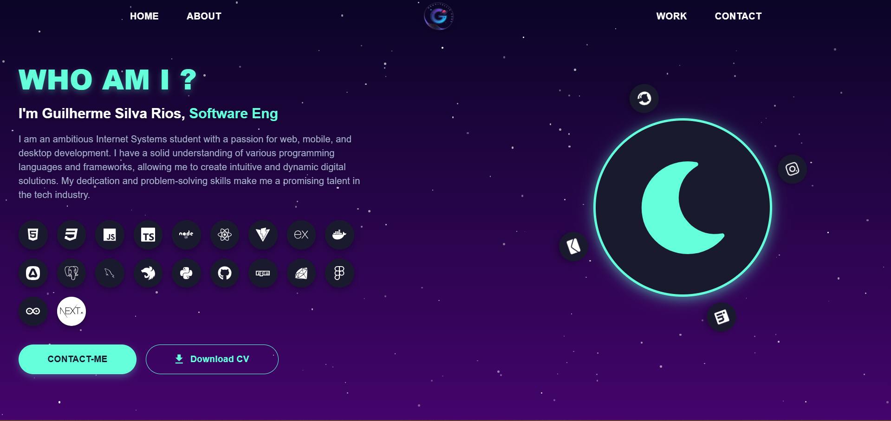
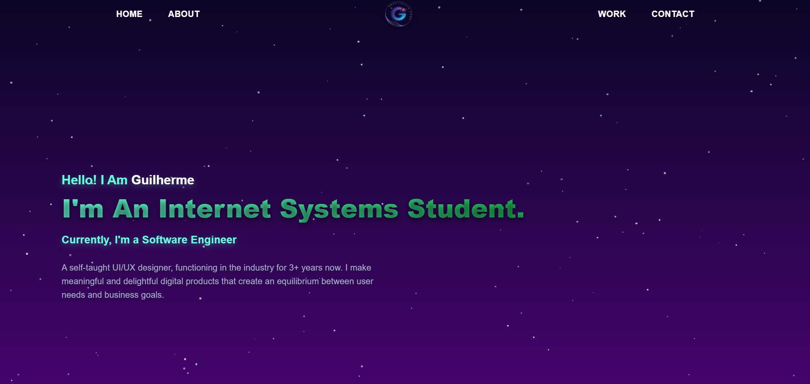
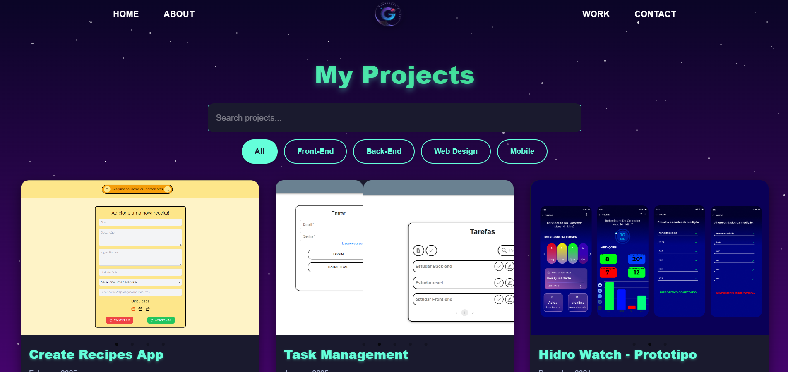
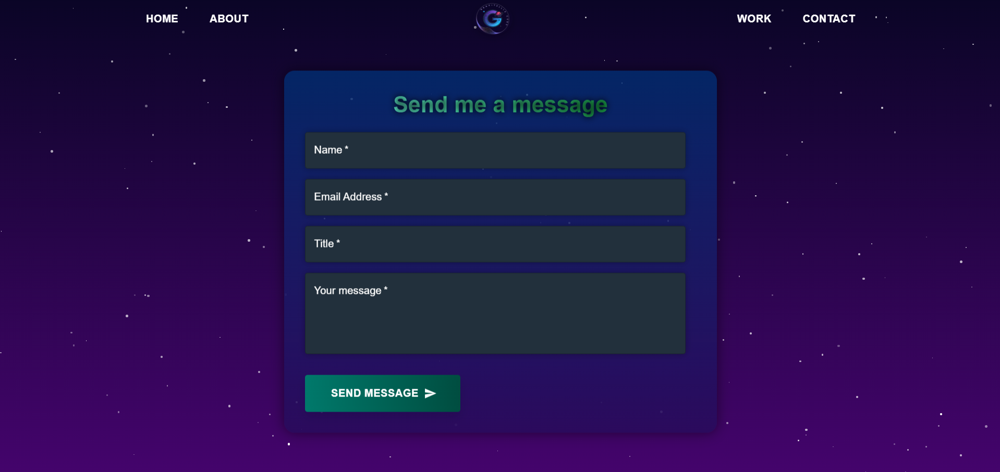

# Meu Portfólio (V1)

Bem-vindo à **primeira versão** do meu portfólio pessoal!  
Este projeto foi desenvolvido para apresentar minhas habilidades, experiências e os projetos nos quais trabalhei.  
Foi construído com **tecnologias modernas de desenvolvimento web**, focando em uma interface **dinâmica e agradável**.

---
## 📱 Paginas do Sistema

<div style="display: flex;">




</div>

---

## ✨ Features

- **Página Inicial Dinâmica:** Apresentação com um efeito de digitação animado para os meus títulos profissionais.
- **Seção de Projetos Completa:**
  - Filtragem por categorias (Front-End, Web Design, etc.).
  - Barra de pesquisa para encontrar projetos específicos.
  - Carrossel de imagens para cada projeto, permitindo a visualização de múltiplas telas.
- **Páginas Detalhadas:** Seções *Sobre Mim*, *Habilidades* e *Contato* para fornecer uma visão completa do meu perfil.
- **Design Interativo:** Fundo estrelado animado que muda de cor conforme a hora do dia.
- **Contato Direto:** Formulário de contato que utiliza o cliente de e-mail do usuário para facilitar a comunicação.

---

## 🚀 Tecnologias Utilizadas

- **Framework/Biblioteca Principal:** [React](https://reactjs.org/)
- **Build Tool:** [Vite](https://vitejs.dev/)
- **Componentes de UI:** [Material-UI (MUI)](https://mui.com/)
- **Estilização:** [Styled Components](https://styled-components.com/) e CSS puro
- **Roteamento:** [React Router](https://reactrouter.com/)
- **Carrossel de Imagens:** [React Slick](https://react-slick.neostack.com/)
- **Ícones:** [React Icons](https://react-icons.github.io/react-icons/)

---

## ⚙️ Como Executar o Projeto Localmente

1. **Clone o repositório:**
   ```bash
   git clone <url-do-seu-repositorio>
   ```

2. **Navegue até o diretório do projeto:**
   ```bash
   cd portifolio
   ```

3. **Instale as dependências:**
   ```bash
   npm install
   ```

4. **Inicie o servidor de desenvolvimento:**
   ```bash
   npm run dev
   ```

Após executar esses comandos, o projeto estará disponível em  
[http://localhost:5173](http://localhost:5173) (ou outra porta indicada no terminal).

---

## 📂 Estrutura do Projeto

```
/src
|-- /assets         # Imagens, logos e outros arquivos estáticos
|-- /components     # Componentes reutilizáveis (Navbar, Cards, etc.)
|-- /pages          # Componentes de página (Home, About, Work, Contact)
|-- /routes         # Configuração de rotas da aplicação
|-- App.jsx         # Componente principal que gerencia as rotas
|-- main.jsx        # Ponto de entrada da aplicação React
```

---

## 📬 Contato

Se você quiser saber mais sobre meu trabalho ou trocar uma ideia, entre em contato:

- **Email:** [seu-email@exemplo.com](mailto:seu-email@exemplo.com)
- **LinkedIn:** [Seu Perfil](https://linkedin.com/in/seu-perfil)
- **GitHub:** [Seu GitHub](https://github.com/seu-usuario)

---
